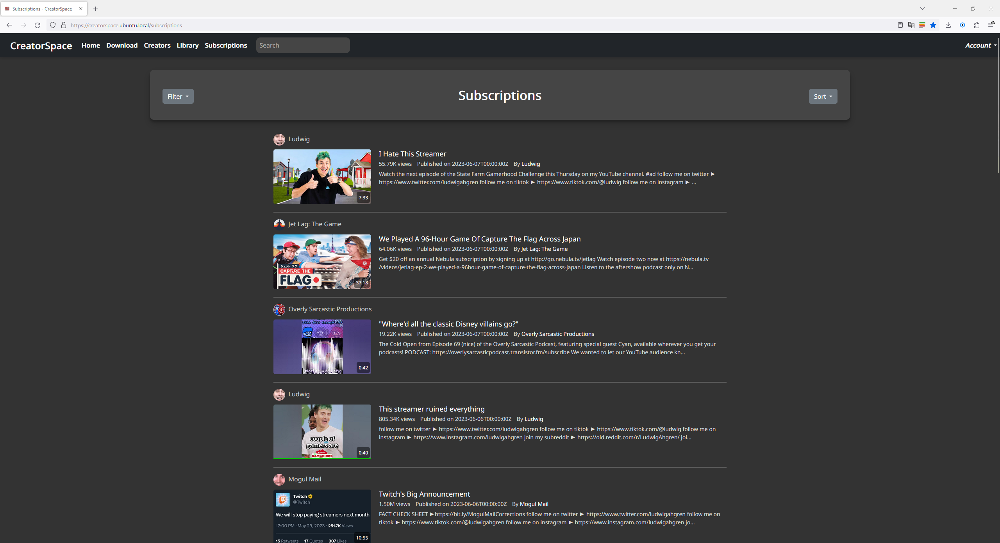

# CreatorSpace


## Introduction

**CreatorSpace** is a comprehensive content archiving platform designed for automatic download and archival of YouTube creators & videos.

## Features

- Archive First Approach
- Automatic Video & Metadata Downloading
- Automatic Metadata Updates
- Updates saved along-side previous versions
- Single Video and Playlist Archiving
- Sponsorblock Integration
- User and Library Management
- Robust API Server
- Enhanced Security
- Self-Hostable Backend
- Optimized Video Handling
- High-Performance Execution

## Tech Stack

- [Go](https://go.dev/)
- [Gin](https://gin-gonic.com/)
- [yt-dlp](https://github.com/yt-dlp/yt-dlp)
- [jwt](https://jwt.io/)

## Screenshots

<details>
<summary>Click to expand</summary>

***Subscriptions*** - View all of your subscriptions in one place.


***Creator View*** - View all of the videos for a specific creator.


***Library View*** - View all of the videos in your library.


***Creators*** - View all of the creators in your library.


***Video Playback*** - Watch and playback videos directly from the application.


***On-Disk Archival*** - All videos, metadata, and updates are saved to disk.


</details>

## Getting Started

### Prerequisites

- [Python](https://python.org/)
- [yt-dlp](https://github.com/yt-dlp/yt-dlp)
- [FFmpeg](https://ffmpeg.org/)

Python is required for yt-dlp, which is used for downloading videos and metadata. FFmpeg is required for transcoding which is not currently implemented but will be in the future.

### Installation

#### Docker Compose

The easiest way to get started is to use the provided [docker-compose.yml](./docker-compose.yml) file. This will automatically download and configure all of the required dependencies.

1. Download the [docker-compose.yml](./docker-compose.yml) file
2. Modify volume paths "/path/to/appdata/" and "/path/to/downloads/" to your desired locations
3. Modify db environment variables to your desired values, these must be input in the setup wizard
4. Run the following command

    ```shell
    docker-compose up -d
    ```

5. Open the application in your browser at <http://localhost:8080>

#### Pre-built Binaries

You can download the pre-built binaries directly from the [releases](https://github.com/ryebreadgit/CreatorSpace/releases/latest) section. Available for Windows, macOS, and Linux.

#### Build Instructions

If you prefer to build the application yourself:

1. Clone the repository

    ```shell
    git clone https://github.com/ryebreadgit/CreatorSpace.git
    ```

2. Change into the directory

    ```shell
    cd CreatorSpace
    ```

3. Change into the "cmd" directory

    ```shell
    cd cmd
    ```

4. Download dependencies

    ```shell
    go get
    ```

5. Build the application

    ```shell
    go build
    ```

6. Move the output to the root folder

    ```shell
    mv CreatorSpace ..
    ```

#### Setting Version Variables

If you are manually building the application, you can set the version variables by passing the following flags to the build command (example uses Linux and version 0.3.1):

```shell
export APPVERSION=0.3.1
export COMMIT_HASH=$(git rev-parse --short HEAD 2>/dev/null || echo unknown 2>/dev/null)
export BUILD_DATE=$(date -u +'%Y-%m-%dT%H:%M:%SZ' 2>/dev/null || echo unknown 2>/dev/null)
go build -ldflags "-X github.com/ryebreadgit/CreatorSpace/internal/api.GitCommit=$COMMIT_HASH -X github.com/ryebreadgit/CreatorSpace/internal/api.BuildDate=$BUILD_DATE -X github.com/ryebreadgit/CreatorSpace/internal/api.AppVersion=$APPVERSION" -o CreatorSpace_$APPVERSION
```

If these variables are not set, the application will default to "unknown" for the version information.

**Please note that this is only required for manual builds, the pre-built binaries and Dockerfile will have these variables set automatically.*

## Contributing

Contributions are always welcome! Please read the [contribution guidelines](CONTRIBUTING.md) first.

## License

This project is licensed under the [MIT License](LICENSE.md).
